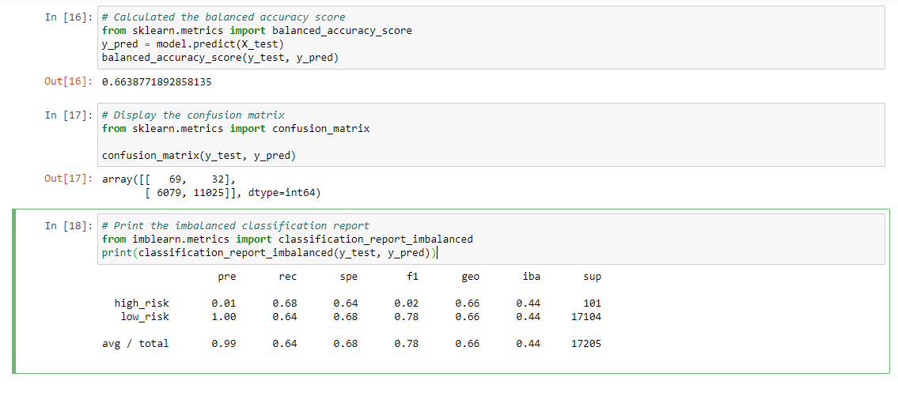
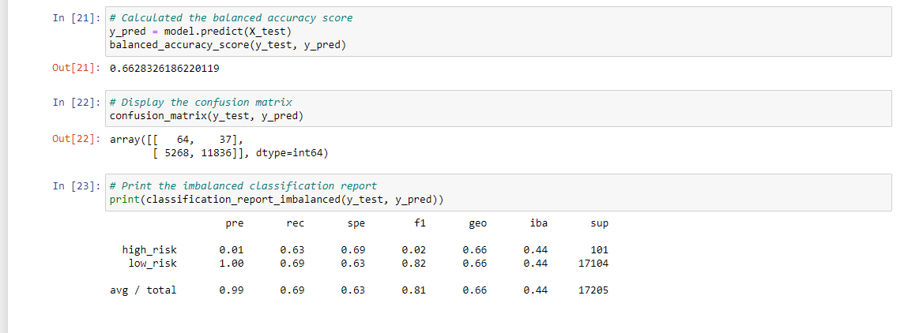
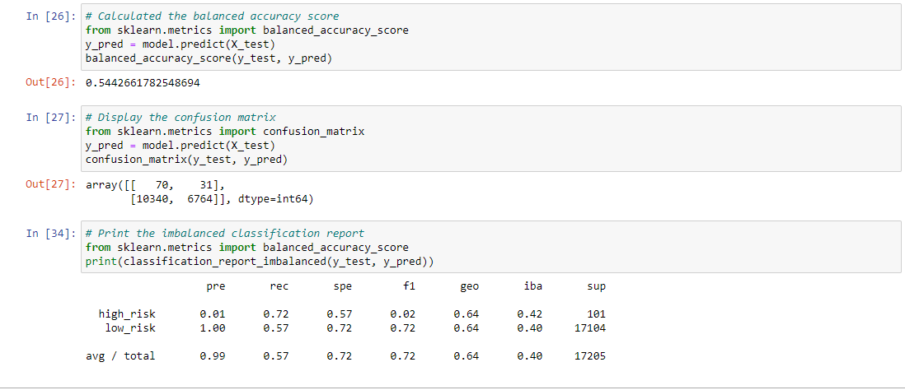
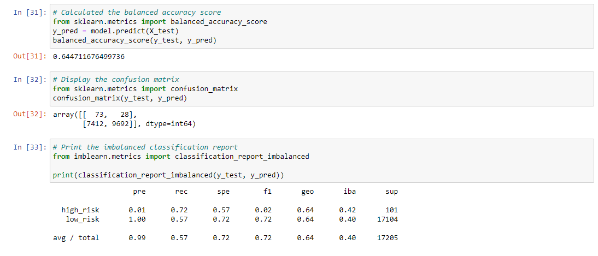
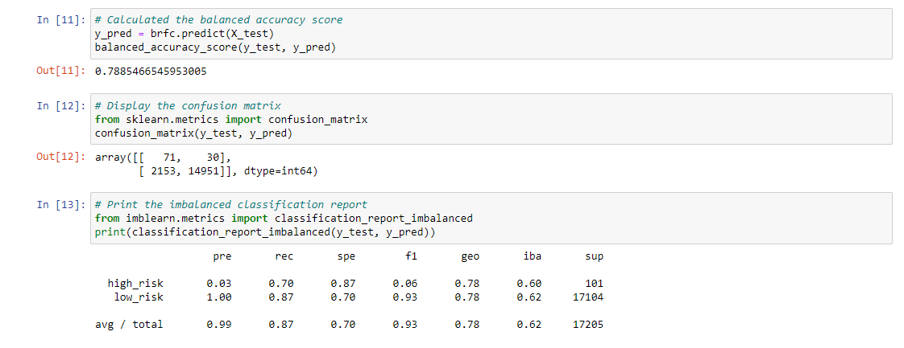
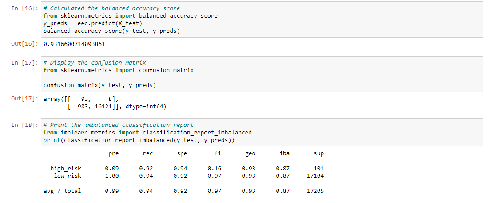

# Credit_Risk_Analysis

## Overview
The purpose of this analysis was to apply our knowledge of machine learning to the real-world challenge of predicting Credit Risk. The number of good loans outweigh the number of bad loans, making this a perfect example for using different machine learning techniques. 

## Results

Our Naive Random Oversampling shows:
    - Balanced Accuracy Score: 0.66387
    - High-Risk Precision: 0.01
    - Low-Risk Precision: 1.00 
    - High-Risk Recall: 0.68
    - Low-Risk Recall: 0.64

Our SMOTE Oversampling shows:
    - Balanced Accuracy Score: 0.66283
    - High-Risk Precision: 0.01
    - Low-Risk Precision: 1.00
    - High-Risk Recall: 0.63
    - Low-Risk Recall: 0.69

Our Undersampling shows:
    - Balanced Accuracy Score: 0.54426
    - High-Risk Precision: 0.01
    - Low-Risk Precision: 1.00
    - High-Risk Recall: 0.72
    - Low-Risk Recall: 0.57

Our Combination shows:
    - Balanced Accuracy Score: 0.64471
    - High-Risk Precision: 0.01
    - Low-Risk Precision: 1.00
    - High-Risk Recall: 0.72
    - Low-Risk Recall: 0.57

Our Balanced Random Forest shows:
    - Balanced Accuracy Score: 0.78854
    - High-Risk Precision: 0.03
    - Low-Risk Precision: 1.00
    - High-Risk Recall: 0.70
    - Low-Risk Recall: 0.87

Our Easy Ensemble Adaboost shows:
    - Balanced Accuracy Score: 0.93166
    - High-Risk Precision: 0.09
    - Low-Risk Precision: 1.00
    - High-Risk Recall: 0.92
    - Low-Risk Recall: 0.94

## Summary
Our Easy Ensemble test returned the highest Balanced Accuracy Score of 0.93166, making it the most effective test. Our lowest was the Undersampling, which returned its effectiveness at 0.54426. It is recommended to use the Easy Ensemble due to its high accuracy and high recall score.